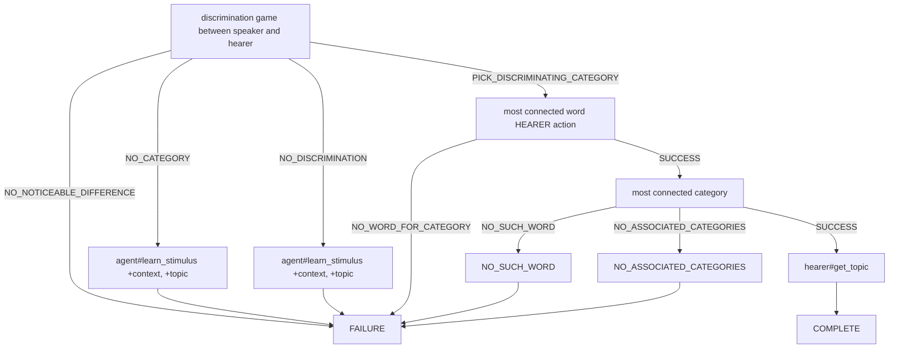
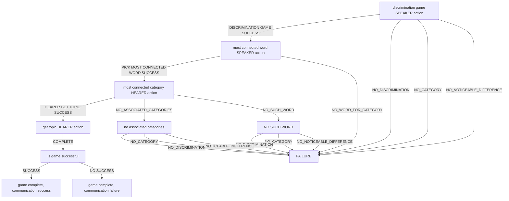

```
agent has categories but is unable to discriminate, lower response for stimulus 1
class NO_DISCRIMINATION_LOWER_1(PerceptionError):
NO USAGE
agent has categories but is unable to discriminate, lower response for stimulus 2
class NO_DISCRIMINATION_LOWER_2(PerceptionError):
NO USAGE
agent fails to select topic using category bcs it produces the same responses for both stimuli
class NO_DIFFERENCE_FOR_CATEGORY(PerceptionError):
NO USAGE
agent has categories but they return 0 as response for stimulus 1
class NO_POSITIVE_RESPONSE_1(PerceptionError):
NO USAGE
agent has categories but they return 0 as response for stimulus 2
class NO_POSITIVE_RESPONSE_2(PerceptionError):
NO USAGE
```

! no use in guessing game
agent#get_convexity/monotonicity
get_active_lexicon->get_best_matching_words->get_best_matching_word->
language.py Language def get_most_connected_word(self, category):
raise ERROR
raise NO_WORD_FOR_CATEGORY

! no use in guessing game
agent.py Agent def get_best_matching_word(self, stimulus):
raise NO_WORD_FOR_CATEGORY


(hearer_category = hearer.get_most_connected_category(speaker_word))->
language.py Language def get_most_connected_category(self, word):
raise ERROR
raise NO_SUCH_WORD
raise NO_ASSOCIATED_CATEGORIES

      
guessing_game -> hearer_topic = hearer.get_topic(context=self.context, category=hearer_category)
agent.py Hearer def get_topic(self, context, category):
raise ERROR

speaker_category = speaker.discrimination_game(self.context, self.topic) ->
perception.py Perception def discriminate(self, context, topic):
raise NO_CATEGORY
raise NO_NOTICEABLE_DIFFERENCE
raise NO_DISCRIMINATION

```
class LanguageError(Exception):

1. agent.py Hearer def get_topic(self, context, category):
2. language.py Language def get_most_connected_category(self, word):
3. language.py Language def get_most_connected_word(self, category):

class NO_WORD_FOR_CATEGORY(LanguageError):
1. agent.py Agent  def get_best_matching_word(self, stimulus):
2. language.py Language def get_most_connected_word(self, category):

class NO_SUCH_WORD(LanguageError):
agent doesn't know the word
1. language.py Language def get_most_connected_category(self, word):

agent has not associated categories with a word
class NO_ASSOCIATED_CATEGORIES(LanguageError):
1. language.py Language def get_most_connected_category(self, word):

agent has no categories
class NO_CATEGORY(PerceptionError):
1. language.py Language def get_most_connected_category(self, word):

agent has categories but cannot discriminate
class NO_DISCRIMINATION(PerceptionError):
1. perception.py Perception  def discriminate(self, context, topic):

stimuli are indistinguishable for agent perception (jnd)
class NO_NOTICEABLE_DIFFERENCE(PerceptionError):
1. perception.py Perception def discriminate(self, context, topic): 
```



FIRST STAGE
speaker_category = speaker.discrimination_game(self.context, self.topic) ->
perception.py Perception def discriminate(self, context, topic):
raise NO_CATEGORY
raise NO_NOTICEABLE_DIFFERENCE
raise NO_DISCRIMINATION
      
SECOND STAGE
(hearer_category = hearer.get_most_connected_category(speaker_word))->
language.py Language def get_most_connected_category(self, word):
raise ERROR
raise NO_SUCH_WORD
raise NO_ASSOCIATED_CATEGORIES

THIRD STAGE
guessing_game -> hearer_topic = hearer.get_topic(context=self.context, category=hearer_category)
agent.py Hearer def get_topic(self, context, category):
raise ERROR

