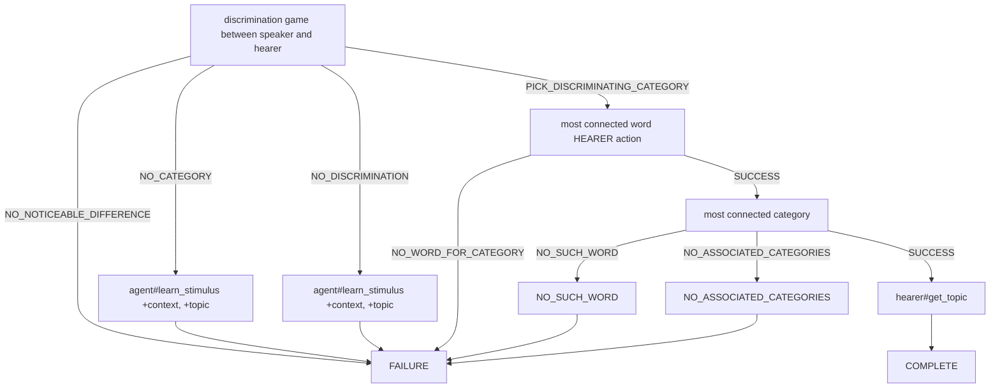

            # raise NO_CATEGORY
            # raise NO_NOTICEABLE_DIFFERENCE
            # raise NO_DISCRIMINATION

```mermaid

  graph TD;
      E[most connected word HEARER action] -- SUCCESS --> G;
      A[discrimination game between speaker and hearer] -- NO_NOTICEABLE_DIFFERENCE --> W;
      A -- NO_CATEGORY --> C[agent#learn_stimulus +context, +topic];
      A -- NO_DISCRIMINATION --> D;
      A -- PICK_DISCRIMINATING_CATEGORY --> E;
      C --> W
      D[agent#learn_stimulus +context, +topic] --> W
      E -- NO_WORD_FOR_CATEGORY --> W;
      G[most connected category] -- NO_SUCH_WORD --> H
      G[most connected category] -- NO_ASSOCIATED_CATEGORIES --> I
      G[most connected category] -- SUCCESS --> J
      H[NO_SUCH_WORD] --> W
      I[NO_ASSOCIATED_CATEGORIES] --> W
      J[hearer#get_topic] --> Z
      Z[COMPLETE]
      W[FAILURE]
```
